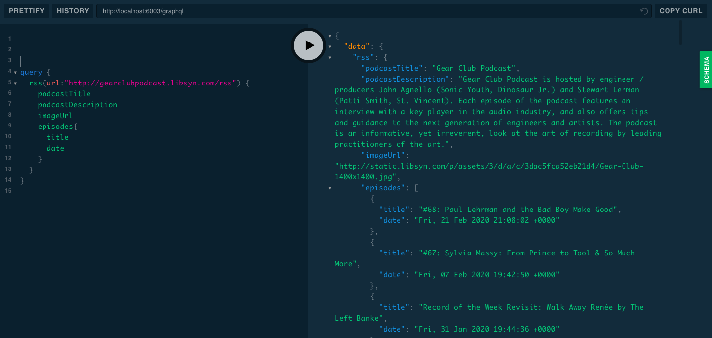

# PodcastManager - Server

Simplified backend for the Podcast organizer app. It is built in nodejs and it uses the Apollo Graphql Server to expose its API. 

A useful feature is a parser that extracts relevant information from an RSS feed in XML and provides it as a JSON object.

LAUNCH INSTRUCTIONS:
  1) npm install
  2) node index.js
